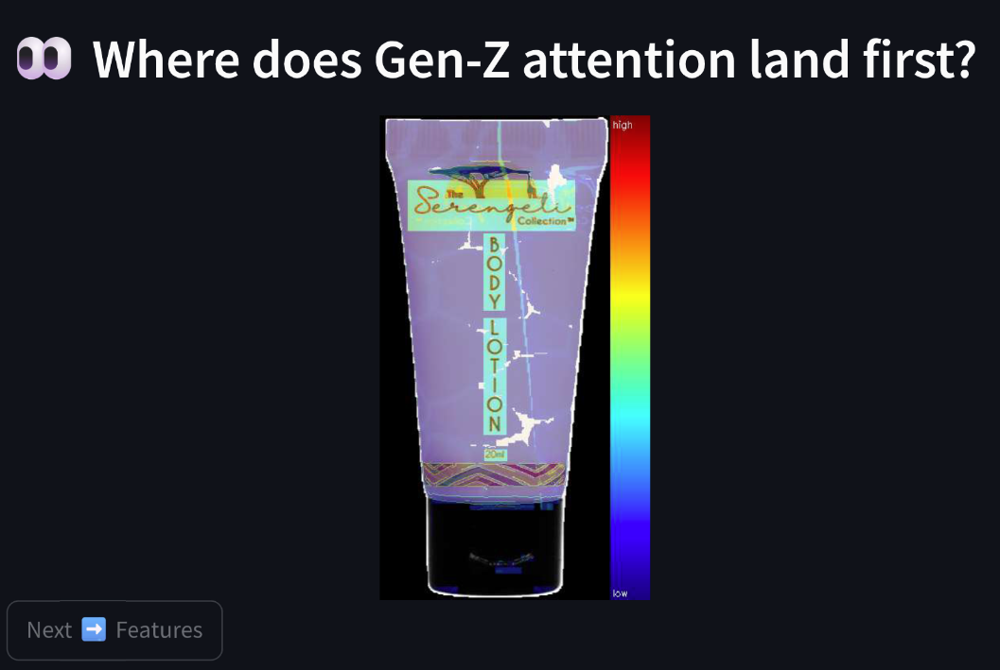
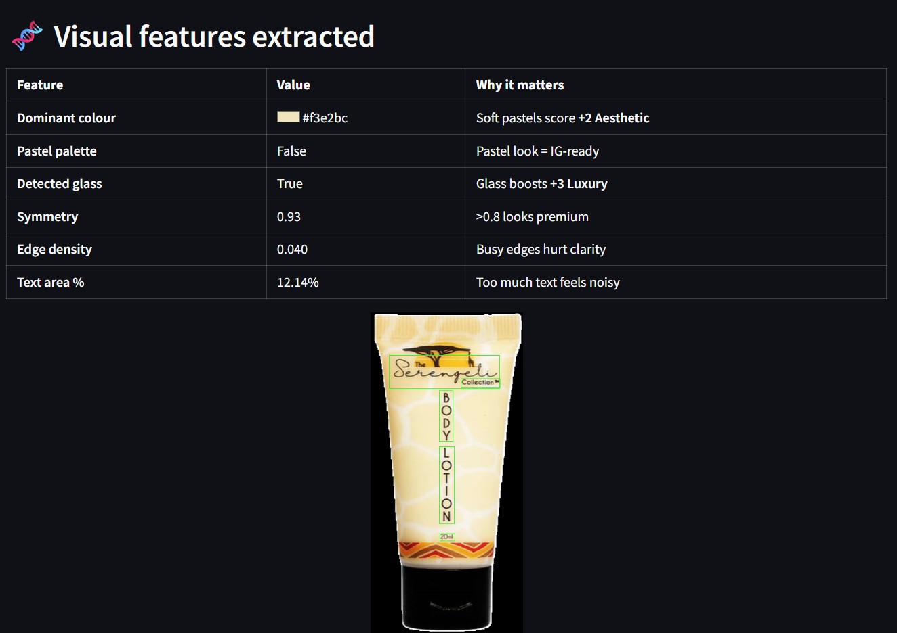
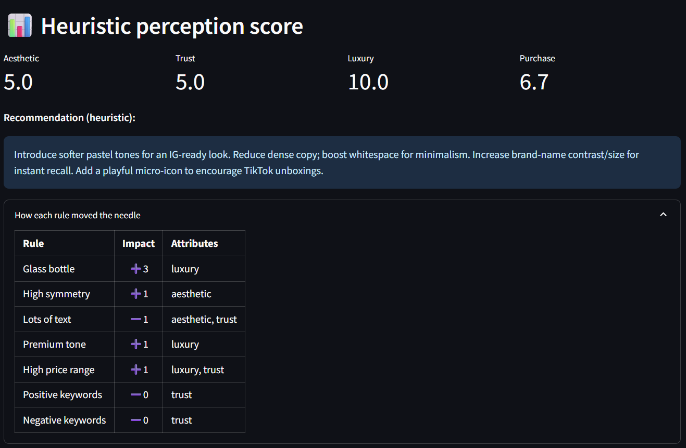
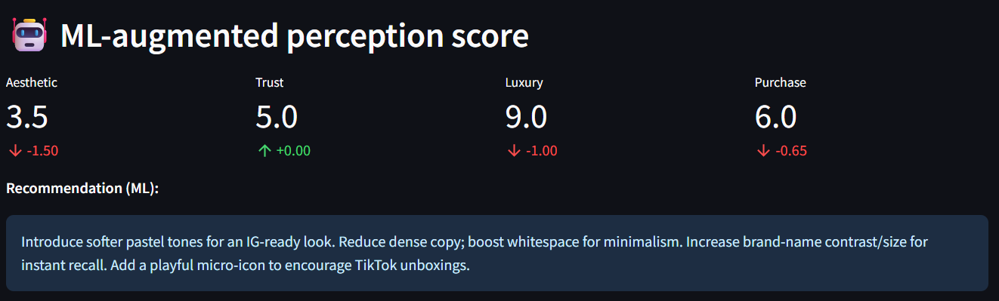
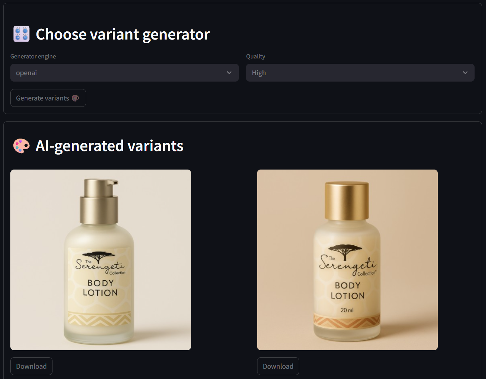

# GenzView™ Design Reasoning Document
*Simulating & Shaping Gen-Z Perception of Cosmetic Packaging* 

*Author: Sujan Adhikari*

## Please go to [inference.pdf](inference.pdf), to view the runtime app flow

## To run the app:
###   (pip install -r requirements.txt)
###   (streamlit run frontend.py)
###   (backend at genzview.py)

---


## Table of Contents
1. [Project Objective](#1-project-objective)  
2. [Target Demographic Persona](#2-target-demographic-persona)  
3. [System Architecture](#3-system-architecture)  
4. [Visual-Feature Engineering](#4-visual-feature-engineering)  
5. [Heuristic-First Perception Scoring](#5-heuristic-first-perception-scoring)  
6. [ML-Augmented Scoring (Opt-In)](#6-ml-augmented-scoring-opt-in)  
7. [Explainability: Heat-Map Generation](#7-explainability-heat-map-generation)  
8. [Recommendation Engine](#8-recommendation-engine)  
9. [AI Variant Generator](#9-ai-variant-generator)  
10. [Future Work](#10-future-work)  
11. [Appendix – Code Map](#11-appendix--code-map)

---

## 1  Project Objective
Create a **Python-based studio** that **mimics how urban Gen-Z trendsetters (18–25, APAC) evaluate cosmetic packaging**.

---

## 2  Target Demographic Persona
| Attribute | Details |
|-----------|---------|
| **Age/Gender** | 18 – 25, female |
| **Region** | Asia-Pacific hot-spots — Seoul, Tokyo, Bangkok |
| **Traits** | Fashion-forward, trend-driven, social-media natives |
| **Values** | Visually pleasing aesthetics, novelty, minimalism, **“Instagrammable”** looks |
| **Digital Behaviour** | High TikTok / Instagram influence, follows beauty KOLs |

These attributes inspire every rule and recommendation inside **`genzview.py`**.

---

## 3  System Architecture
<div align="center">

```mermaid
%%{init: { "theme": "default", "themeVariables": { "fontSize": "15px", "GanttFontSize": "15px", "TaskFontSize": "15px", "NoteFontSize": "15px", "SequenceFontSize": "15px", "gitGraphFontSize": "15px" } } }%%
flowchart TD
    A["Input (image + metadata)"] --> B{Pre-processing}
    B --> C["Visual-Feature Extraction"]
    B --> D[OCR]
    C --> E[Heuristic Rule Engine]
    D --> E
    E --> F["Perception Scores (0-10)"]
    F --> G[Recommendation Generator]
    F --> H[Heat-Map\nBuilder]
    %% Optional path
    F -. "opt-in" .-> I["ML Delta: (CLIP + BLIP2)"]
    I -.-> F
    J[Variant Prompt Builder]
    G --> J
    K["SD 3.5 / OPENAI / API"]
    J --> K
    L["Outputs: json/png"]
    H --> L
    K --> L
````

</div>

---

## 4  Explainability: Heat-Map Generation



### Layer Composition

| Weight | Layer               | Visual Cue               |
| -----: | ------------------- | ------------------------ |
|    0.4 | **Edges** (`Canny`) | Complexity hotspots      |
|    0.4 | **OCR Map**         | Where text exists        |
|    0.3 | **Symmetry diff**   | Asymmetry penalties      |
|    0.2 | **Saturation**      | Color intensity focus    |
|    0.2 | **Hue Δ**           | Contrast vs dominant hue |

Final map → `COLORMAP_JET`, blended with original product mask for clarity, plus a side legend (“high ↘ low”).

---

## 5  Visual-Feature Engineering



| Feature             | Extraction Method (Code)                                  | Why It Matters to Gen-Z                                   |
| ------------------- | --------------------------------------------------------- | --------------------------------------------------------- |
| **Dominant Color**  | `k-means (k=3)` in `_dominant_color`                      | Sets immediate mood; Gen-Z leans pastel & muted neutrals. |
| **Pastel Palette**  | HLS thresholds in `_is_pastel`                            | Soft pastel shades score **+ 2 Aesthetic**.               |
| **Edge Density**    | Canny ratio in `_edge_density`                            | Too many edges ⇒ clutter ⇒ – Clarity & Trust.             |
| **Text-Area Ratio** | OCR contour area in `_text_area`                          | Dense copy feels noisy on small phone screens.            |
| **Symmetry**        | Mirror-difference in `_symmetry`                          | High symmetry subconsciously implies premium craft.       |
| **Glass Detection** | Multi-cue in `_is_glass` (specular + transparency + edge) | Glass bottles scream **luxury** & recyclability.          |

> 📸 The **“Visual features extracted”** screen-shot (3rd image) is a direct render of these values.

---

## 6  Heuristic-First Perception Scoring



### 6.1 Rule Catalogue

| Rule                                | ΔAesthetic |      ΔTrust | ΔLuxury | Rationale                   |
| ----------------------------------- | ---------: | ----------: | ------: | --------------------------- |
| Pastel palette                      |     **+2** |             |         | IG-ready soft vibe          |
| Glass bottle                        |            |             |  **+3** | Premium material perception |
| High symmetry (> 0.8)               |     **+1** |             |         | Visually pleasing order     |
| Busy edges (> 0.15)                 |     **–1** |      **–1** |         | Hurts legibility & trust    |
| Lots of text (> 3 %)                |     **–1** |      **–1** |         | Gen-Z favours minimal copy  |
| Premium brand tone                  |            |             |  **+1** | Metadata boost              |
| High price (mid ≥ \$50)             |            |      **+1** |  **+1** | Price as luxury anchor      |
| Positive keywords (e.g., “vitamin”) |            | **+1** each |         | Ingredient trust            |
| Negative keywords (e.g., “paraben”) |            | **–1** each |         | Safety concern              |

**Implementation**: `GenzView._heuristic_score()` initialises all scores to 5 and pipes each rule through the helper `add(rule, amt, targets)` — ensuring **clamp 0-10** and full audit-trail via the `contrib` list.

### 6.2 Purchase Likelihood

After rules run,

```python
purchase = round((aesthetic + trust + luxury) / 3, 2)
```

mirrors how the three pillars interplay in purchase decisions.

---

## 7  ML-Augmented Scoring (Optional)

*Disabled by default to respect the “heuristic-first” mandate.*



| Model             | Purpose                                                                                             | File Section  |
| ----------------- | --------------------------------------------------------------------------------------------------- | ------------- |
| **CLIP ViT-L/14** | Measures “Instagrammable pastel minimalist” vs “outdated clutter” similarity; gives **ΔAesthetic**. | `_ml_delta()` |
| **BLIP2 2.7 B**   | Generates captions; keywords like “glass” ⇒ **ΔLuxury**, “clean” ⇒ **ΔTrust**.                      | `_ml_delta()` |
| **Torch seeds**   | `torch.manual_seed(seed)` for reproducible deltas.                                                  | `__init__`    |

Deltas are ***capped*** (e.g., ±1.5 for Aesthetic) to keep heuristics sovereign.

---

## 8  Recommendation Engine

```python
if s.aesthetic < 7 and not f["pastel_palette"]:
    rec.append("Introduce softer pastel tones for an IG-ready look.")
```

Pattern: **score-aware + feature-aware + demographic trait-aware** logic.

*Examples of conditional advice*

| Condition                             | Prototype Recommendation                                  |
| ------------------------------------- | --------------------------------------------------------- |
| Symmetry < 0.8                        | “Realign graphics for perfect symmetry.”                  |
| Text area > 3 %                       | “Reduce dense copy; boost whitespace for minimalism.”     |
| Missing brand name in OCR             | “Increase brand-name contrast/size for instant recall.”   |
| No glass & category ∈ {serum, bottle} | “Consider frosted glass or metallic accents on the cap.”  |
| Trend-driven trait present            | “Add a playful micro-icon to encourage TikTok unboxings.” |

---

## 9  AI Variant Generator



### Prompt Builder

`_variant_prompt()` stitches together:

* Live scores (e.g., adds “pastel minimalist” if Aesthetic < 7)
* Cached recommendation keywords (“rose-gold detail”)
* Metadata (category, brand-tone)

### Back-ends (selectable)

| Engine                 | Library/API                              | Strengths                   |
| ---------------------- | ---------------------------------------- | --------------------------- |
| **Local SD 3.5**       | `diffusers` `AutoPipelineForImage2Image` | GPU, offline, full control  |
| **Stability SD3 API**  | `requests` REST                          | Cloud render, no GPU needed |
| **OpenAI gpt-image-1 Edit** | `openai` Python SDK                      | High-quality realism        |

---


## 10  Future Work

* **Dynamic rule learning** — mine new heuristics from user feedback logs
* **Real-time mobile preview** (AR) to test packages on shelf backdrops
* **Fine-tuned diffusion checkpoint** trained on brand assets to stabilise typography retention

---

## 11  Appendix – Code Map

| File Section | Function / Class                                                | Role in Pipeline                 |
| ------------ | --------------------------------------------------------------- | -------------------------------- |
| Top          | `DemographicProfile`                                            | Hard-coded Gen-Z traits          |
| Top          | `PerceptionScores`                                              | Unified score container          |
| §1           | `__init__`                                                      | Seed control, optional deps      |
| §2           | `_analyse()`                                                    | Calls every low-level feature fn |
| §3           | `_heuristic_score()`                                            | Rule engine & audit trail        |
| §4           | `_ml_delta()`                                                   | CLIP/BLIP2 delta calculator      |
| §5           | `_recommend()`                                                  | Textual design advice            |
| §6           | `_heatmap()`                                                    | Layer-stacked attention map      |
| §7           | `generate_variants()`                                           | Multi-backend variant maker      |
| Low-level    | `_dominant_color`, `_edge_density`, `_is_glass`, `_symmetry`, … | Feature primitives               |

---

**GenzView™ brings together rule-based clarity, optional ML “spice,” and generative creativity.